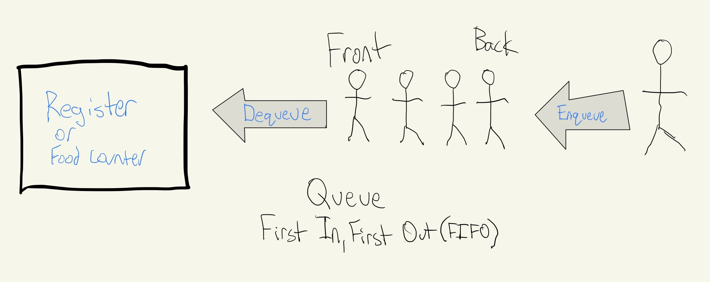
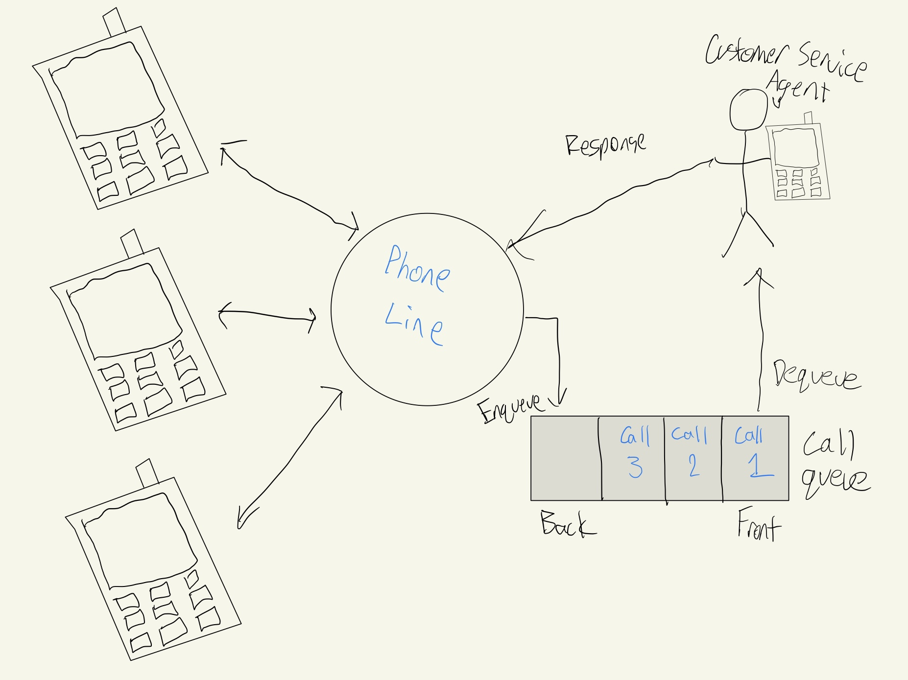

# Queue
Think of what happens when you go to the check-out line at the grocery store, when you call customer service and hear: "Your call will be answered in the order that it was received." Think of when a website like Amazon or any other web server that receives multiple requests. What do these all have in common? 

The queue is a a way that we manage data and is used in many different ways in real life. It is characterized as "First In, First Out", also known as FIFO. In all of the examples given in the previous paragraph, the first person in the line or the first person to call or click is the first person to be helped/served. 

## Examples of Queues

### Restaurant
In the example shown below, there is a busy fast food restaurant that we are using to show a real life example of a queue. This can be seen many places, such as the grocery store, fast food restaurant, car wash, etc. The person at the front is the next person to order/pick up their food. When they are removed, it is called a dequeue operation, which removes the first in the queue. When another person gets in line, they get in the back of the line, which is called an enqueue option. In this example, no one is able to get in the front of the line. No line cutters or jumpers permitted in this restaurant!



### Calling Customer Service
If you've ever called customer service for a company before, you may have heard this phrase: "All of our representatives are currently helping other customers. Your call will be answered in the order that it was received. Please hold." In the following example, there is multiple people calling and only one customer service agent able to answer the phone. If the agent is already on a call, they are unable to help you or any more calls until they finish the one they are on. A phone queue is used to solve this problem. 



As someone new calls, they get added to the back of the queue (enqueue), and move up as each person in the queue is helped by an agent (dequeue). 

## Efficiency of Common Operations
| Common Queue Operation |  Description | C# Code | Performance |
| :-----: | :------------: | :-----:| :-----: |
| enqueue(value) | Inserts "value" to the queue | `myQueue.Enqueue(value)`| O(1) |
|  dequeue() | Removes item from beginning of queue | `myQueue.Dequeue()` | O(1)|
|  size() | Returns number of elements in the queue | `myQueue.Count` | O(1) |
|  empty()  | Returns true if the queue length is zero | `if (myQueue.Count == 0)` | O(1) |

## Example: Baking Cookies
Here is an example of a queue. When baking cookies, you have ingredients and a recipe that you need to follow. 
```csharp
var cookies = new Queue<string>();

cookies.Enqueue("1 cup sugar");
cookies.Enqueue("1 cup brown sugar");
cookies.Enqueue("2 sticks of butter");
if (cookies.Count == 3) // If correct number of ingredients, mix them
{
    cookies.Dequeue();
    cookies.Dequeue();
    cookies.Dequeue();
}

cookies.Enqueue("2 eggs");
cookies.Dequeue();

cookies.Enqueue("1/4 teaspoon salt");
cookies.Enqueue("2 teaspoon vanilla");
cookies.Enqueue("2 teaspoon hot water, 1 teaspoon baking soda");
cookies.Dequeue();
cookies.Dequeue();
cookies.Dequeue();

cookies.Enqueue("3 cups flower");
cookies.Dequeue();

cookies.Enqueue("2 cups chocolate chips");
cookies.Dequeue();
```
In the example, whenever we are using enqueue, we are adding an ingredient to the bowl, and whenever we dequeue, we are mixing the ingredient in. After adding the first 3 ingredients, it is required to mix them to get the right consistency. We use the size operation to make sure it's the right amount.


## Problem to Solve
Write a program that allows the user to enter a line at Disney World and wait through line. Since Disney World has an extra paid fast pass option, there should be an the functionality to give priority to someone with a fast-pass. 

Here are the requirements:

* Add people to line in the correct order
* Remove people from line in the correct order
* Have a max line length so that no one can enter after it's full
* Ability to show line length
* Ability to give priority to fast pass users when adding them to the line
* Ability to handle dequeue if the queue is empty.

You can check your code with the solution here: [Solution](queue-problem-solution)

[Back to the Welcome Page](welcome.md)