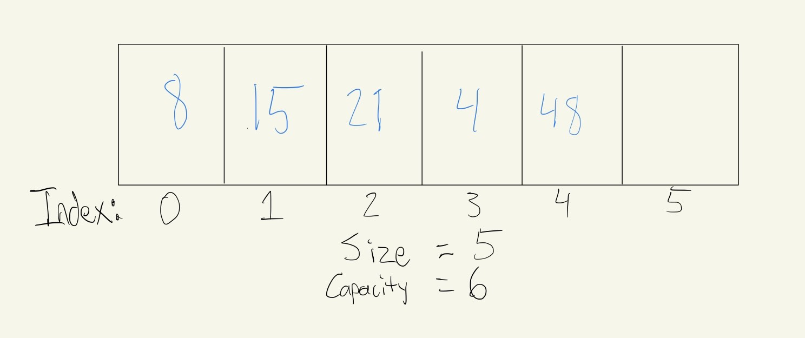
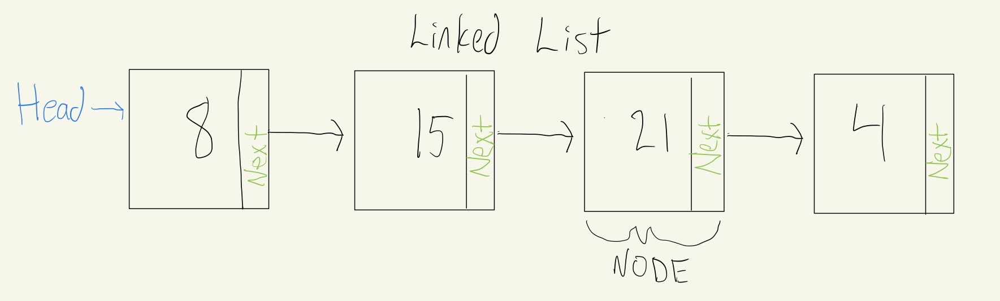
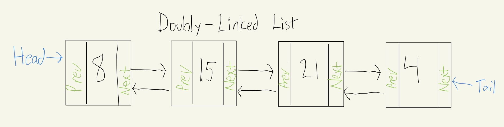
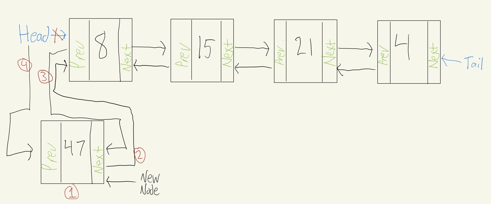
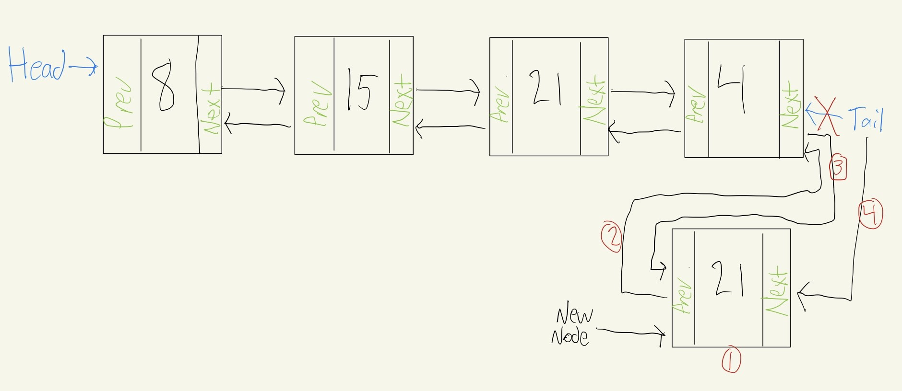
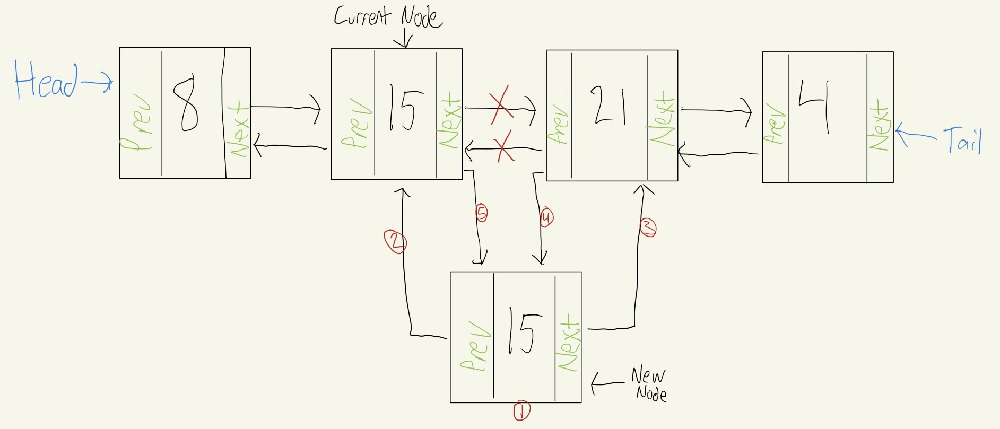
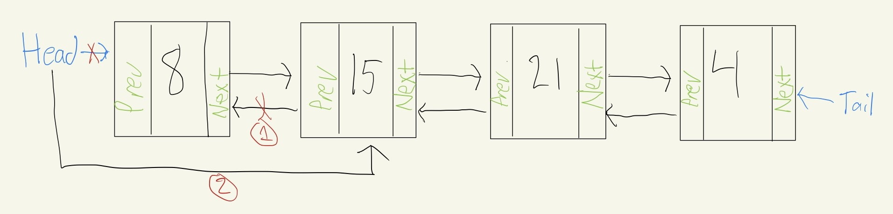
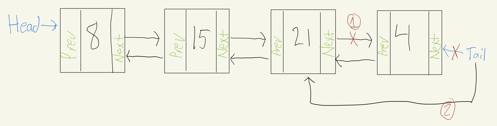
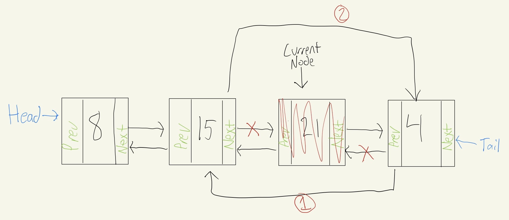

# Linked List

## Introduction
Linked lists are very similar to dynamic arrays. 
There are 3 different types of linked lists. There is the linked list where the head is linked to the next element. This is called a single linked list. There is also a doubly-linked-list, where the head (first value) is linked to the next element, and the next element is linked to the previous element. Then there is also a circular linked list, where it's very similar to a doubly-linked-list, except the tail, the value at the end, is linked to the head, the value at the beginning. We are going to focus on the doubly linked list in this tutorial.

## Structure

As you can see in the following picture, dynamic arrays are characterized by contiguous memory. Each item inside of a dynamic array is right next to the next item in memory. Because of this, we can access items very easily. The formula to calculate the memory address of each item is as follows: (address = startingAddress + (index * itemSize)). Queues, stacks, sets, and maps are all based on memory that are organized in this way. 



We can also store a collection of data in a random way within memory. This is how a **linked list** is organized. Each element in the list is at some location in memory, with no guarantee that one element will end up next to another. The way to keep the list together, each element (node) will contain the value, and it will also contain a link to the next node in the list. The link is a pointer to the location in memory that the next element is contained in. 



As you can see in the linked list shown in the picture above, the first node is called the **head**. If we know where the head is, we are able to traverse the entire linked list. We do this by following the pointers. However, doubly-linked lists are far more commonly used than the linked list shown above. Doubly-linked lists utilize bi-directional linking between nodes. This means that each node has a pointer to the next node as well as the previous node. In the example below, we can see that it has both a head and a tail. In a circular linked list, the tail would also have a pointer that linked the tail to the head.



## Inserting
When we insert into a dynamic array, we have to worry about moving items over towards to the end to maintain contiguous memory. When we insert into a linked list, we only affect the neighboring elements. All we have to do is adjust the pointers to connect the nodes together. We just have three scenarios to consider, which are inserting at the head, the tail, or in the middle.

Inserting at the head requires a four step process when the list is not null.
1. Create a new node (`newNode`)
2. Set the "next" of the new node to the current head (`newNode.Next = head`)
3. Set the "prev" of the current head to the new node (`head.Prev = newNode`)
4. Set the head equal to the new node (`head = newNode`)



There's a special case that exists for inserting at the head (and the tail). If the linked list is empty (`head == null`), then all we have to do is both the head and the tail to the new node we created.

Inserting at the tail is very similar to inserting at the head, but with a few things reversed.

1. Create a new node(we will call it (`newNode`) 
2. Set the "prev" of the new node to the current tail (`newNode.Prev = tail`)
3. Set the "next" of the current tail to the new node (`tail.Next = newNode`)
4. Set the tail equal to the new node (tail = newNode)



Inserting into the middle is more complicated.

1. Create a new node (`newNode`)
2. Set the prev of the new node ot the current node (`newNode.Prev = current`)
3. Set the next of the new node to the next node after current (`newNode.Next = current.Next`)
4. Set the prev of the next node after current to the new node (`current.Next.Prev = newNode`)
5. Set the next of the current node to the new node (`current.Next = newNode`)



## Removing
Removing the first or last node from a linked list is similar and involve setting updating the second node, or the second to last node in the case of the removing the tail. The process for removing the first node is: 

1. Set the prev os the second node (`head.Next`) to nothing (`head.Next.Prev = null`)
2. Set the head to be the second node (`head = head.Next`)



The process for removing the last node is: 

1. Set the next of the second to last node (`tail.Prev`) to nothing (`tail.Prev.Next = null`)
2. Set the tail to be the second to last node (`tail = tail.Prev`)



Removing from the middle is a lot easier than inserting from the middle. As you can see in the picture, we are removing the node `current`. This process only involves two steps:

1. Set the prev of the node after current to the node before current (`current.Next.Prev = current.Prev`)
2. Set the next of the node before current to the node after current (`current.Prev.Next = current.Next`)



## Accessing from list
When we want to find a value or specific node in the linked list, we have to loop through the list. If we want to go forward through the list, we will start at the head. We can also choose to go backward through the list and start at the tail. To loop through the list, we have to follow the "next" links until we get the end, or the "prev" if we are starting from the tail. The following code shows an implementation of a basic traversal through a linked list moving from node to node.

```csharp
private void GoForward() {
    // Start at the beginning (the head)
    var current = _head;

    // Loop through until we read the end
    while (current != null) {
        // Do something with the current node
        Console.WriteLine(current.Data);
        
        // Follow the pointer to the next node
        current = current.Next;
    }
}
```

## Efficiency of common operations
| Common Linked List Operation |  Description | C# Code | Performance |
| :-----------------: | :---------------------------------------------------: | :---------------------------------:| :-----: |
| insert_head(value)  | Adds "value" before the head                          | `linkedList.AddFirst(value)`       | O(1) - Only need to adjust the pointer near the head |
| insert_tail(value)  | Adds "value" after the tail                           | `linkedList.AddLast(value)`        | O(1) - Only need to adjust the pointer near the tail|
| insert(node, value) | Adds "value" after the node "node"                    | `linkedList.AddAfter(node, value)` | O(n) - Not complicated to adjust the pointers to insert, but a loop is required to find the node to insert after |
| remove_head()       | Removes the first item (the head)                     | `linkedList.RemoveFirst()`         | O(1) - Only need to adjust the pointer near the head |
| remove_tail(index)  | Removes the last item (the tail)                      | `linkedList.RemoveLast()`          | O(1) - Only need to adjust the pointer near the tail |
| remove(node)        | Removes node "node"                                   | `linkedList.Remove(node)`          | O(n) - Not complicated to adjust the pointers to remove, but a loop is required to find the node to remove|
| size()              | Returns the size of the linked list                   | `linkedList.Count`                 | O(1) - The size is maintained within the linked list class |
| empty()             | Returns true if the length of the linked list is zero | `if (linkedList.Count == 0)`       | O(1) - The comparison of the length with 0 is all that is needed |

## Comparing Dynamic Array and Linked List
| Common Operations |  Dynamic Array | Linked List | 
| :----------------:| :------------: | :----------:|
| Insert Front      | O(n)           |  O(1)       |
|  Insert Middle    | O(n)           | O(n)        |
|  Insert End       | O(1)           | O(1)        |
|  Remove Front     | O(n)           | O(1)        |
|  Remove Middle    | O(n)           | O(n)        |
|  Remove End       | O(1)           | O(1)        |

As we can see, dynamic arrays are efficient when dealing with the end, but linked lists are efficient at both the beginning and the end.

## Example

To create our own LinkedList instead of using the built in `LinkedList<T>` class built into C#, we first have to create a node class. This can be done in a separate class or it can be an inner class. We will do it as a separate class.

```csharp
public class Node
{
    public string Data { get; set; }
    public Node? Next { get; set; }
    public Node? Prev { get; set; }

    public Node(int data)
    {
        this.Data = data;
    }
}
```

Here we are creating the node. Each node of the linked list will have data and links to the previous and next node. Now let's write the code for the linked list. We are going to implement the ability to insert into the head, remove the head, and insert after a value.

```csharp
public class LinkedList : IEnumerable<int> {
    // Initializing the head and tail
    private Node? _head = null;
    private Node? _tail = null;

    public void InsertHead(int value) {
        var newNode = new Node(value);

        // If the head is null, we point the head and the tail to the newNode.
        if (_head is null) {
            _head = newNode;
            _tail = newNode;
        }
        // If the list isn't empty, we just update the head
        else {
            newNode.Next = _head;
            _head.Prev = newNode;
            _head = newNode;
        }
    }

    // If the head is the same as the tail and is the only value, we set it to null. Otherwise we just disconnect the first value and set the second value to the head.
    public void RemoveHead() {
        if (_head == _tail) {
            _head = null;
            _tail = null;
        }
        else if (_head is not null) {
            _head.Next.Prev = null;
        }
    }

    public void InsertAfter(int value, int newValue) {
        // Search for the node that matches 'value' by starting at the 
        // head of the list.
        var curr = _head;
        while (curr is not null) {
            if (curr.Data == value) {
                // If the location of 'value' is at the end of the list,
                // then we will affect the self.tail.
                if (curr == _tail) {
                    var newNode = new Node(newValue);
                    // Connect the new node to the current tail
                    newNode.Prev = curr;
                    // Connect the current tail to the new node
                    curr.Next = newNode;
                    // Set the tail to the new node
                    _tail = newNode;
                }
                // For any other location of 'value', need to create a
                // new node and reconnect the links to insert.
                else {
                    var newNode = new Node(newValue);
                    // Connect new node to the node containing 'value'
                    newNode.Prev = curr;
                    // Connect new node to the node after 'value'
                    newNode.Next = curr.Next;
                    // Connect node after 'value' to the new node
                    curr.Next.Prev = newNode;
                    // Connect the node containing 'value' to the new node
                    curr.Next = newNode;
                }

                return; // We can exit the function after we insert
            }

            curr = curr.Next; // Go to the next node to search for 'value'
        }
    }
```

Now we have created the code to insert an integer into the head and to be able to remove it. But we don't have a way of going through the list yet and displaying the values. To do that, we will use the following code:

```csharp

    IEnumerator IEnumerable.GetEnumerator() {
        // call the generic version of the method
        return GetEnumerator();
    }

    /// Iterate forward through the Linked List
    public IEnumerator<int> GetEnumerator() {
        var curr = _head; // Start at the beginning since this is a forward iteration.
        while (curr != null)
        {
            // Do Stuff
            yield return curr.Data;
            curr = curr.Next;
        }
    }

    public override string ToString() {
        return "[linked_list]{" + string.Join(", ", this.Select(i => i.ToString())) + "}";
    }
}
```

## Problem to Solve

When we listen to music, it generally has a skip (next) or previous buttons. This means it is a perfect real world example of a linked list! Write a program that allows for the following: 

Here are the requirements:

* Add song to the beginning of the list to play next
* Add new song to end of the list to play last
* Add song to the middle to play in between songs
* Add the ability to remove the current song
* Add the ability to remove the last song
* Add the ability to replace a song
* Add the ability to traverse the list to display the results

You can check your code with the solution here: [Solution](linked_list-problem-solution)

[Back to the Welcome Page](welcome.md)