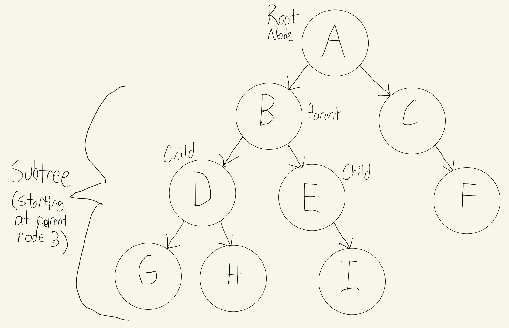
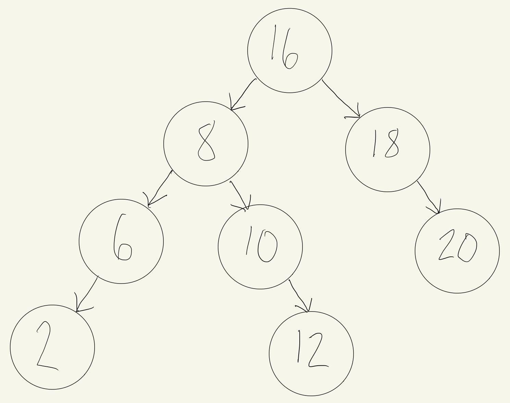
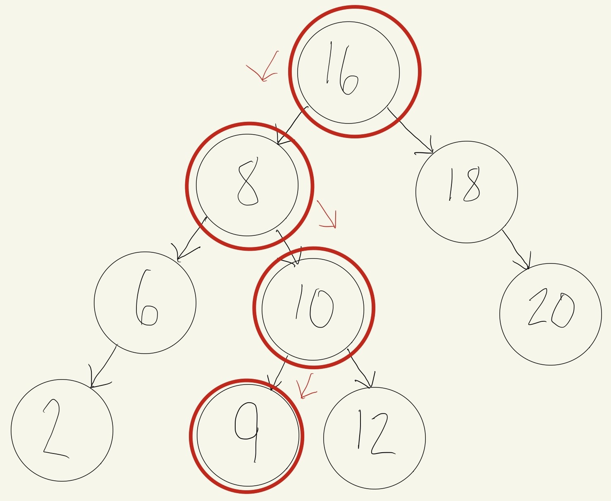
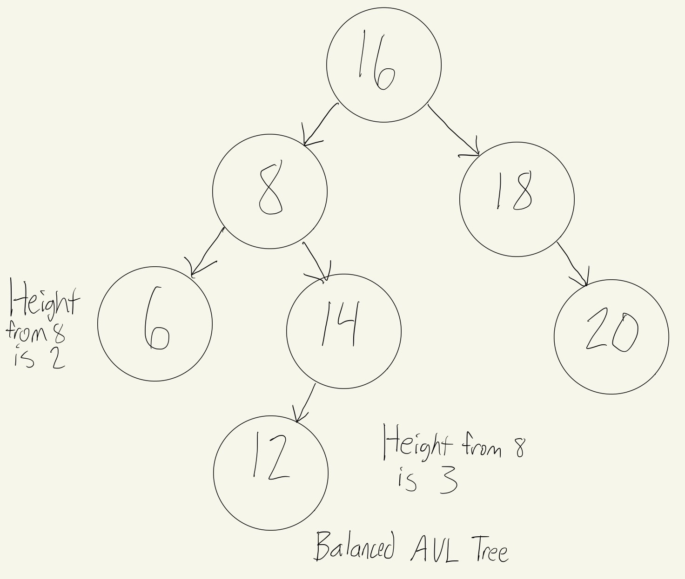
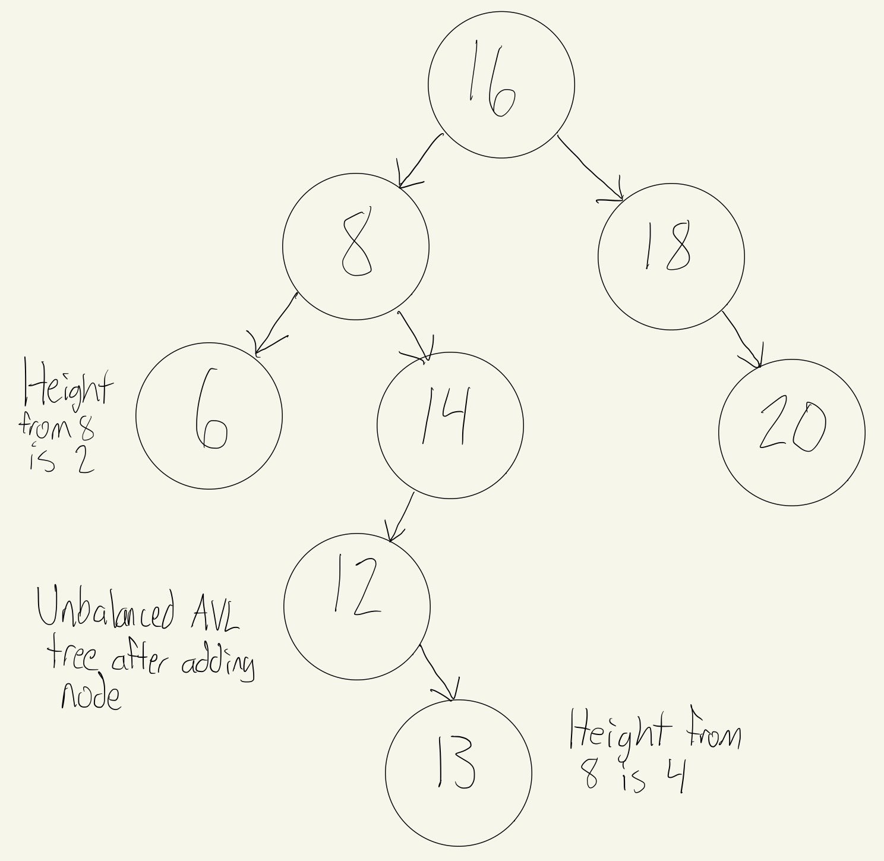
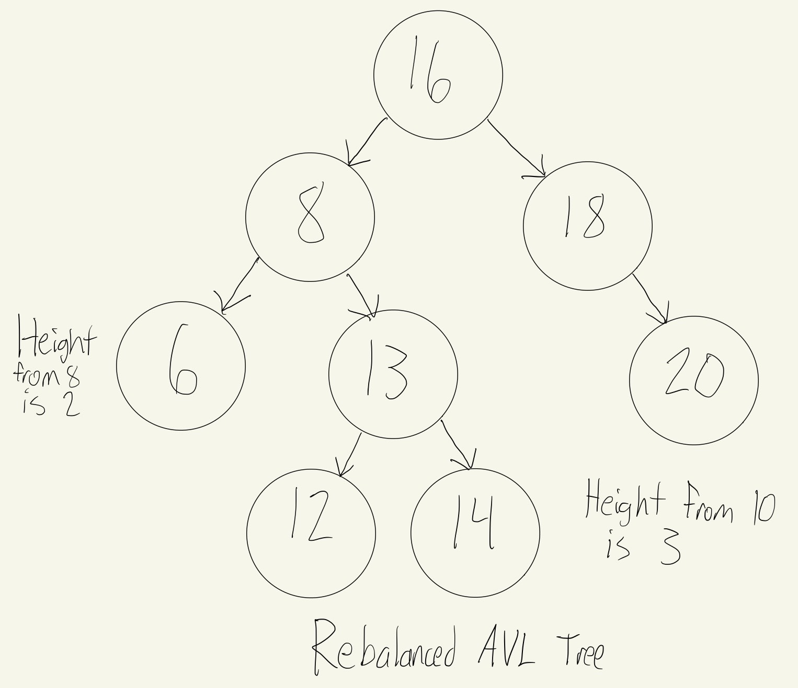

# Tree

## Introduction

**Trees** are very similar to linked lists. In both cases, nodes are connected together by pointers. Unlike linked lists, however, a tree is able to connect to multiple different nodes. We'll be going over 3 different types of trees in this tutorial.

## Types of Trees

### Binary Trees

A **binary** tree is a tree which links to at most 2 other nodes. In the example tree seen below, we can see that the top node is called the **root** node. When a node doesn't connect to any other nodes, it is called a **leaf** node. A node that has nodes connected to it is called a **parent** node. The nodes that are connected to the parent are known as **child** nodes. Nodes to the left and right of any parent node form a subtree. There will only ever be one root node, because only one node can be at the top.



In the example, A is the root node. B is a parent node. D and E are child nodes. G, H, I, and F are the leaf nodes since they don't connect to any other node.

### Binary Search Trees

**Binary search trees** (*or BST*) follow specific rules for data being inserted into the tree. Each node being inserted into the tree needs to be compared to the data in the parent node. If the data that is being added is less than the parent node, than it will go into the left subtree. If the data being added is greater than the parent node, it needs to go into the right subtree. If we are allowing duplicates to be stored, the duplicate can go in either the left or the right of the root. Using this process makes it so that the data being stored into the tree is sorted.



Using this tree that we have above, we are able to know where to place additional items. We will start at the root node every time and compare the new value with it to decide where to put it. We will continue comparing until we find an empty place for the new node. For example, when we want to insert 9, we will do the following:

* Start at the root node of 16 and compare with the new value of 9
* Since 9 is less than 16, go to the left and visit node 8
* Since 9 is greater than 8, go to the right and visit node 10
* Since 9 is less than 10, go to the left and see there is no additional node
* Insert 9 in the empty spot to the left of 10



The process that was used to find where to put the new node was efficient. Using a dynamic array or a linked list, this would have been an O(n) operation to locate the proper location to insert the value into the proper sorted position. Because we used BST, we were able to exclude a subtree with each comparison, effectively splitting the job in half recursively. Because of this, the efficiency is O(log n). We were only able to do this in O(log n) time was because the tree was balanced. If we were to start with 2 and go in ascending order, everything would go to the right node, creating an unbalanced tree. This tree was balanced because we started with 16 first.

### Balanced Binary Search Trees

In a **balanced BST**, the difference between the height of a subtree and either the left or right counterpart should not be greater than 2. In order to find the height of the tree, we count the maximum number of nodes between roots and the leaves. It's not reasonable to expect the order of data to result in a balanced BST, so numerous algorithms were written to detect if a tree is unbalanced and correct it. Some common algorithms that use a balanced BST include red black trees and AVL (Adelson-Velskii and Landis) trees. 



If we add 13 to the right of 12, we end up with an unbalanced AVL tree because the height of the right subtree from 8 is now 2 more than the left subtree.



The AVL algorithm will detect that the tree has become unbalanced. To balance the tree, a node rotation will be performed. For our tree, the node with 13 will rotate so that nodes 12 and 14 are children nodes of the 13. When the rotation is done, the tree returns to a balanced state. An AVL tree will always be a Balanced BST and therefore benefit from O(log n) performance.



If you want to learn more about AVL trees, you can read about them [here](https://en.wikipedia.org/wiki/AVL_tree). Additionally, if you would like to learn more about red black trees since we didn't go over it, feel free to read about them [here](https://en.wikipedia.org/wiki/Red%E2%80%93black_tree).

## Recursion

Normally when writing functions, we design them so that they call different functions. However, **Recursion** is a technique where the function calls itself. Recursion is an important concept when it comes to trees. 

```csharp
public void SayHello() {
    Console.WriteLine("Hello");
    SayHello(); // This is the recursive call
}
```

If you notice though, this is going to be an endless function that runs until C# eventually stops it with a Stack overflow because it was called too many times. Because of this situation, there are 2 rules to recursion.

### Rules of recursion

When using recursion, there are two important rules that we have to follow:

* Smaller Problem - When we call the function recursively, we need to make sure that we are calling the function on a smaller problem. Without this rule, the function will run forever.
* Base Case - As we continue to call the function on a smaller problem, we need a place to stop. We need to define a scenario in which recursion is not required. This is called the base case.

Lets apply the two rules to the `SayHello` function. 
```csharp
public void SayHello(int count) {
    // This is the base case. If the count is 0 or less than 0, we return and end the function. 
    if (count <= 0) {
        return;
    }
    else {
        Console.WriteLine("Hello");
        // Count - 1 is the smaller problem.
        SayHello(count - 1);
    }
}
```

In this case, this should have been done using a simple `for` loop instead of using recursion. Recursion is not something that we should be using in every situation. When used inappropriately, it can result in significant performance degradation. However, when we use it wisely, a simple code solution can be found for complex problems, such as trees.

## Inserting into BST

To insert into a BST, we have to use recursion: 

* Smaller problem: Insert a value into either the left or the right subtree based on the value.
* Base case: If there is space to add the node (the subtree is empty), then the correct place has been found and the item can be inserted.

Similar to how we used Nodes in linked lists, we will use them again in Trees. 

```csharp
public class BinarySearchTree : IEnumerable<int> {
    private Node? _root;

    public void Insert(int value) {
        if (_root is null)
            _root = new Node(value);
        else
            _root.Insert(value);
    }
}
```

This Insert function we just created in BinarySearchTree is the method that is called by the user wanting to insert a value into the tree. We use this method to call a Recursive method from the Node class:

```csharp
public class Node {

    public void Insert(int value) {
        if (value < Data) {
            // Value belongs on the left side
            if (Left is null) {
                // Empty spot found
                Left = new Node(value);
            }
            else  {
                // Need to keep looking, use recursion on the left subtree
                Left.Insert(value);
            }
        }
        else {
            // Value belongs on the right side
            if (Right is null) {
                Right = new Node(value);
            }
            else {
                Right.Insert(value);
            }
        }
    }

}
```

## Traversing a BST

When we want to display all of the data the tree contains, we will **traverse** the BST. An in-order traversal makes it so we visit each node from smallest to largest. A similar node can be used to traverse backwards from largest to smallest. This is another process that uses recursion for maximum efficiency: 

* Smaller problem: Traverse the left subtree of a node, use the current node, and then traverse the right subtree of the node.
* Base case: If the subtree is empty, then don't recursively traverse or use anything.

We will also need to use the IEnumerator interface, which C# uses to enable `foreach` loops over custom classes. To implement it, the class must implement 2 GetEnumerator functions.

* The first `IEnumerator IEnumerable.GetEnumerator()` is the required function for all `IEnumerable` objects, but it doesn't specify the type of item being enumerated.
* The second public `IEnumerator<int> GetEnumerator()` is what is called when using a foreach lop to inform the compiler that each loop will produce an int value.

```csharp
IEnumerator IEnumerable.GetEnumerator() {
    // call the generic version of the method
    return GetEnumerator();
}

public IEnumerator<int> GetEnumerator() {
    var numbers = new List<int>();
    TraverseForward(_root, numbers);
    foreach (var number in numbers) {
        yield return number;
    }
}

private void TraverseForward(Node? node, List<int> values) {
    if (node is not null) {
        TraverseForward(node.Left, values);
        values.Add(node.Data);
        TraverseForward(node.Right, values);
    }
}
```

Lets take the Binary Search Tree example from above to explain this function.


The `TraverseForward` function is being recursively caused first to go through the Left branch and add the values starting at the bottom. The function is originally called by the `GetEnumerator()` function. It is adding them to the numbers list, and for each number, it adds it to the list and does a yield return. For each value, it'll return the value and then keep going until we reach the base case, when node is null.

So it'll start and go down to the lowest value. It will return 2, then recursively call the function again and return 6, and then 8. Then there's no more child data to 8, so it'll go down to the right branch of that subtree and return 10, then 12, and then back up to 16 and repeat on that Right branch.

## Efficiency of common operations

| Common BST Operation |  Description | Performance |
| :-----------------: | :---------------------------------------------------: |  :-----: |
| `insert(value)`       | Insert a value into the tree                  |  O(log n) - Recursively search the subtrees to find the next available spot |
| `remove(value)`  | Remove a value from the tree                       | O(log n) - Recursively search the subtrees to find the value and then remove it. This will require some cleanup of the adjacent nodes |
| `contains(value)` | Determine if a value is in the tree               | O(log n) - Recursively search the subtrees to find the value |
| `traverse_forward`       | Visit all objects from smallest to largest |  O(n) - Recursively traverse the left subtree and then the right subtree |
| `traverse_reverse`  | Visit all objects from largest to smallest      | O(n) - Recursively traverse the right subtree and then the left subtree |
| `height(node)`        | Determine the hight of a node. If the height of the tree is needed, the root node is provided    |  O(n) - Recursively find the height of the left and right subtrees and then return the maximum height (plus one to account for the root) |
| `size()`              | Returns the size of the BST                 |  O(1) - The size is maintained within the BST class |
| `empty()`             | Returns true if the root node is empty. This can also be done by checking for the size for 0. | O(1) - The comparison of the root node or the size |

## Example

Lets say we don't want any duplicate data in our tree. Here is how you would do that. First we we have to create a Node class and set it up. We set up the left and right, and to get the data similar to how we did linked lists with head and tail. The insert will be setup very similar to how we did it earlier in the how to insert section. We just make a small change. 

```csharp
public class Node {
    public int Data { get; set; }
    public Node? Right { get; private set; }
    public Node? Left { get; private set; }

    public Node(int data) {
        this.Data = data;
    }

    public void Insert(int value) {
        // By adding this if statement, if the value exists, then we just return and don't insert anything.
        if (value == Data)
            return;
        else if (value < Data) {
            // Insert to the left
            if (Left is null)
                Left = new Node(value);
            else
                Left.Insert(value);
        }
        else {
            // Insert to the right
            if (Right is null)
                Right = new Node(value);
            else
                Right.Insert(value);
        }
    }
}
```

```csharp
public class BinarySearchTree : IEnumerable<int> {
    private Node? _root;

    public void Insert(int value) {
        Node newNode = new Node(value);

        if (_root is null)
            _root = newNode;
        else
            _root.Insert(value)
    }
}
```

## Problem to Solve

Write a program that takes an input of some numbers and returns the height of the BST. The height should return as 4.

Here are the requirements:

* The ability to insert into the tree
* Traverse through the BST to get the height.
* Input numbers in this order: "7, 5, 6, 8, 9, 4, 10"

You can check your code with the solution here: [Solution](tree-problem-solution)

[Back to the Welcome Page](welcome.md)